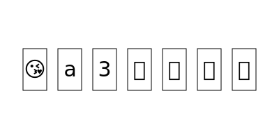
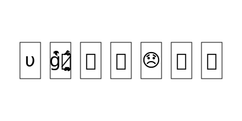
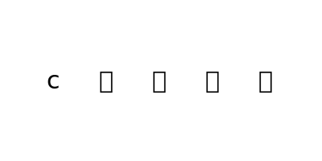

# Canto Namespace Protocol

Canto Namespace Protocol is a subprotocol for the Canto Identity Protocol that enables users to mint names with tiles that are contained in trays. Trays can be minted for a fee or traded on the secondary market.

## Tray
A tray is represented as an ERC721 token (NFT). Each tray contains 7 tiles (see below). A user calls `buy` and passes in an `amount` to buy the specified amount of trays. Each tray has a fixed price. The 7 tiles per tray are then generated according to a deterministic algorithm. A user can therefore precompute which trays he will get.

An image for every tray is dynamically generated. Two example trays are shown here:

There is a prelaunch phase where trays can be minted for distribution to the community. However, these trays can only be used (transferred or fused) during the prelaunch phase and become useless afterwards. 

## Tile
A tile is one character in a specific font. Different fonts have different probabilities to appear in a tile. The fonts are:
| **Font Class** | **Name**        | **Shares** | **Characters** |
|----------------|-----------------|------------|----------------|
| 0              | Emoji*           | 32         | ✨✅❗⚡☕⭐❌⚽❓⏰⭕⚫⚾☔⚪✋✊😂🤣😭😘🥰😍😊🎉😁💕🥺😅🔥🙄😆🤗😉🎂🤔🙂😳🥳😎💜😔💖👀😋😏😢💗😩💯🌹💞🎈💙😃😡💐😜🙈😄🤤🤪😀💋💀💔😌💓🤩🙃😬😱😴🤭😐🌞😒😇🌸😈🎶🎊🥵😞💚🖤💰😚👑🎁💥😑🥴💩🤮😤🤢🌟😥🌈💛😝😫😲🔴🌻🤯🤬😕🍀💦🦋🤨🌺😹🌷💝💤🐰😓💘🍻😟😣🧐😠🤠😻🌙😛🙊🧡🤡🤫🌼🥂😷🤓🥶😶😖🎵😙🍆🤑😗🐶🍓👅👄🌿🚨📣🍑🍃😮💎📢🌱🙁🍷😪🌚🏆🍒💉💢🛒😸🐾🚀🎯🍺📌📷💨🍕🏠📸🐇🚩😰🌊🐕💫😵🎤🏡🥀🤧🍾🍰🍁😯💌💸🧁😺💧💣🤐🍎🐷🐥📍🎀🥇🌝🔫🐱🐣🎧💟👹💍🍼💡😽🍊😨🍫🧢🤕🚫🎼🐻📲👻👿🌮🍭🐟🐸🐝🐈🔵🔪😧🌄😾📱🍇🌴🐢🌃👽🍌📺🔔🌅🦄🎥🍋🥚💲📚🐔🎸🥃😿🚗🌎🔊🦅🚿🦆🍉🍬🧸🍨📝📩💵💭🌍🍿🧿🏀🍏🌳🙉😦🍹🍦🛑🍔🍂🐒🍪🙀🍗🌠🎬🌵🍄🐐🍩🦁📞🍅🐍💬🥤😼🌾🧀🎮🧠🌏🔝🌉🤒👗🌲🍜🐦🍯🏅🐼💄👺🔞🎆🎨🍞🎇🦜🐑🐙🦍🔗📖🔹🥓🥒🍸👍🙏🤦🤷👏👌💪👉🤞🙌👇🙋👈👋🖕💃👊🏃🤘🤝🤙🚶💅🤟👎🙇👶🤲👆🕺💁🙅🧚🤸👐🤚👼👧🤜🤰🧘🙆👸👦🛌🤛👮❤️☺️♥️❣️✌️☀️☹️‼️☠️➡️⚠️✔️☝️⬇️❄️⁉️☎️✝️☘️✈️▶️✍️⬅️☁️☑️♻️👁️🖐️🗣️🌧️🕊️🏵️🏖️🇺🇸🇧🇷🇺🇲🏳️‍🌈 |
| 1              | Basic           | 32         | abcdefghijklmnopqrstuvwxyz0123456789 |
| 2              | Script          | 16         | 𝒶𝒷𝒸𝒹𝑒𝒻𝑔𝒽𝒾𝒿𝓀𝓁𝓂𝓃𝑜𝓅𝓆𝓇𝓈𝓉𝓊𝓋𝓌𝓍𝓎𝓏 |
| 3              | Script Bold     | 8          | 𝓪𝓫𝓬𝓭𝓮𝓯𝓰𝓱𝓲𝓳𝓴𝓵𝓶𝓷𝓸𝓹𝓺𝓻𝓼𝓽𝓾𝓿𝔀𝔁𝔂𝔃 |
| 4              | Olde            | 8          | 𝔞𝔟𝔠𝔡𝔢𝔣𝔤𝔥𝔦𝔧𝔨𝔩𝔪𝔫𝔬𝔭𝔮𝔯𝔰𝔱𝔲𝔳𝔴𝔵𝔶𝔷 |
| 5              | Olde Bold       | 4          | 𝖆𝖇𝖈𝖉𝖊𝖋𝖌𝖍𝖎𝖏𝖐𝖑𝖒𝖓𝖔𝖕𝖖𝖗𝖘𝖙𝖚𝖛𝖜𝖝𝖞𝖟 |
| 6              | Squiggle        | 4          | αႦƈԃҽϝɠԋιʝƙʅɱɳσρϙɾʂƚυʋɯxყȥ |
| 7              |  Zalgo**             | 2          | a̷̢̝̫̭̐͒̇̅̉̌b̸̡̡̲̪̙͇̆͋̂̄̿̈́̄̈́̓c̶̫̱̐́̐̀͘d̷̳̟̮̼͙̫̬̫͎͎̎̾ẽ̸̋͜͝f̴̭͕̬̪͉̝̈́͘g̴̢͔̤͍̤̫̥̠̥̺̒ĥ̴̢̨̩͈͕̦̰͓̺͒͐͛į̴͖͙̳̻̓͊͊̚͠ͅj̶͙͖͉̪̍̿̈͝k̷̰͉͍͊̐͊͑̂̾̐͒̃͝ļ̸̥̬͉̳͖̋̾m̶̨̧̳͖̫̫̗͒̀̈́̿͝ͅǹ̸̛͙̲̺͒̏̑ȏ̵̺̘̬̭̘͑̌̏̄̑̂͐͠͝p̷̡̬͇̞̔͑̋̌̾̿q̶̡̼̙̲̳̰͈̊͗̂̈̄͊̒ͅř̷̛̰s̶̳̲̼͊̋̈́̑̌̒͌͝͝t̵̆̾̌͌͘ͅu̷̥̫̹̔͜v̶̻̤̥́̅́͠w̷̢͕̩̤̬̮̙̪͈̲̐͂͊͒͋̐̚͠͝x̶̝̠̺̻̱͋͒̊͝y̵̢̥̟̭̯̫̲͐̃̈́͘ͅz̴͙̖͌͋̋͒̿̾̇̎͘͝|
| 8              | Blocks          | 2          | 🄰🄱🄲🄳🄴🄵🄶🄷🄸🄹🄺🄻🄼🄽🄾🄿🅀🅁🅂🅃🅄🅅🅆🅇🅈🅉 |
| 9              | Blocks Inverted | 1          | 🅰🅱🅲🅳🅴🅵🅶🅷🅸🅹🅺🅻🅼🅽🅾🅿🆀🆁🆂🆃🆄🆅🆆🆇🆈🆉 |

*For emojis that support skin tone modifiers, these can be specified when fusing. For instance, 👍 becomes 👍🏿 when the skin tone modifier 5 is passed. The following skin tone modifiers are supported:
| **Value** | **Modifier**        |
|-----------|---------------------|
| 0         | Yellow, no modifier |
| 1         | 🏻                   |
| 2         | 🏼                   |
| 3         | 🏽                   |
| 4         | 🏾                   |
| 5         | 🏿                   |

**Note that the Zalgo distortions are individually generated for every tile. The number of characters is therefore much higher, as every character can appear with different distortions.

## Namespace
Different tiles can be fused to a namespace NFT. For instance, you can fuse the name 𝒸𝓪𝔫𝖙🅾 if you own trays with these characters (in these fonts). Afterwards, the name 𝒸𝓪𝔫𝖙🅾 will resolve to the fused namespace NFT. For namespaces, an image is also generated dynamically on-chain, e.g.:

### Fusing
To fuse a namespace NFT, the user specifies the trays and the tiles (offsets) within the trays to use. Note that the whole tray is always burned, even if you only use some tiles of a tray.
For some emojis, the user can specify a skin tone modifier which will be applied.

A fusing fee that is proportial to the length of the name is charged.